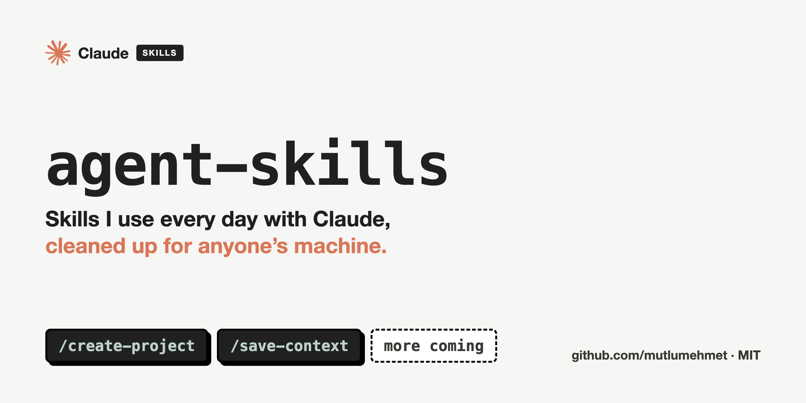

# agent-skills



[](https://github.com/sponsors/mutlumehmet)
[](https://buymeacoffee.com/mutlumehmet)
[](LICENSE)

Agent Skills I use every day with Claude, cleaned up so they work on anyone's machine.

A skill is a folder with a `SKILL.md` file: instructions, plus small scripts where needed, that Claude
loads when a task calls for it. Nothing here is tied to my setup. Anything that differs between
people lives in a config file outside the repo, and every integration beyond the basics is optional.

## Skills

Each skill has its own page with what it does, its settings and what it will never do.

| Skill | What it does |
|---|---|
| [`create-project`](skills/create-project) | Sets up a new project folder the same way every time, for code or for a folder of notes and documents: asks a few questions, keeps heavy and sensitive files out of git, writes `CLAUDE.md` and `STATUS.md` |
| [`save-context`](skills/save-context) | Before you close a session, saves what it decided, changed and left open to the right places (`STATUS.md`, memory, registers, other skills), after you approve one plan, so the next session starts with it in context |

## Install

**As a Claude Code plugin.** Add this repo as a marketplace once, then install the skills you want:

```
/plugin marketplace add mutlumehmet/agent-skills
/plugin install <skill>@mutlumehmet-agent-skills
```

Plugin skills are namespaced, so a skill runs as `/<skill>:<skill>`, or just describe the task and
Claude picks it up.

**As a plain skill** (Claude Code, or anywhere that reads a skills folder): copy or symlink a skill
folder into your skills directory.

```bash
git clone https://github.com/mutlumehmet/agent-skills.git
ln -s "$PWD/agent-skills/skills/<skill>" ~/.claude/skills/<skill>
```

Each skill's page has its exact commands.

## Contributing

Issues and pull requests are welcome. The rules every skill follows are in [`CLAUDE.md`](CLAUDE.md):
nothing personal in the repo, everything configurable has a default, English only.

`scripts/check-personal.sh` is a pre-commit hook that refuses commits containing anything from your
own list of personal terms (kept outside the repo). Install it with:

```bash
ln -sf ../../scripts/check-personal.sh .git/hooks/pre-commit
```

## About

I'm Mehmet Mutlu, a London-based software engineer with 10+ years of building for the web, now
focused on AI. I was an early adopter of AI in day-to-day engineering and became my team's AI
advocate, building agentic workflows that were adopted by teams and professionals. Today I build
AI-native solutions for businesses with complex workflows, and AI tools for teams, engineers,
designers and professionals. This repo is where I share the pieces that proved useful day to day.

- Portfolio: [mehmetmutlu.dev](https://www.mehmetmutlu.dev)
- LinkedIn: [Mehmet Mutlu](https://www.linkedin.com/in/mehmet-mutlu-03aa7319a/)
- X: [@findmutlu](https://x.com/findmutlu)
- GitHub: [@mutlumehmet](https://github.com/mutlumehmet)

If a skill here saves you some time, you can [sponsor me on GitHub](https://github.com/sponsors/mutlumehmet) or [buy me a coffee](https://buymeacoffee.com/mutlumehmet).

## License

[MIT](LICENSE)
